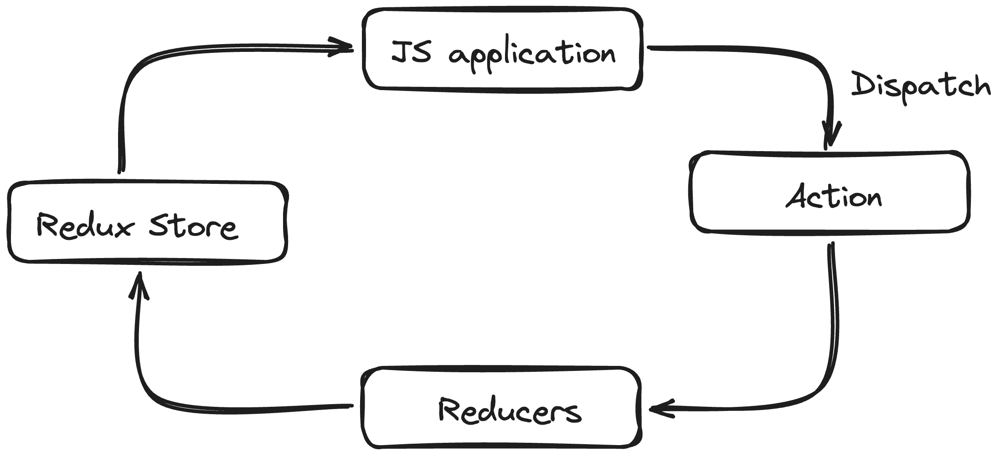

# Redux and Redux-Toolkit demo

This repository contains code for

- Redux and Redux Toolkit in a simple JS application
- Redux Toolkit in a React application (JS / TS)

The structure of the state that we will be managing is

```json
{
  "books": {
    "inStock": 100
  },
  "journals": {
    "inStock": 50
  }
}
```

## Concepts

#### What is Redux?

Redux is a predictable state container for all JavaScript applications

#### Three Core Concepts of Redux

1. Store - holds the state of the application
2. Action - describes what's happening in the application
3. Reducer - handles the actions and describes how to update the state

#### Three Principles of Redux

1. Application state is stored as an single object
2. Only way to update the state is to dispatch an action (an object that describes what has happened)
3. Write pure reducers that determines how the state changes
   <br>
   <br>
   
